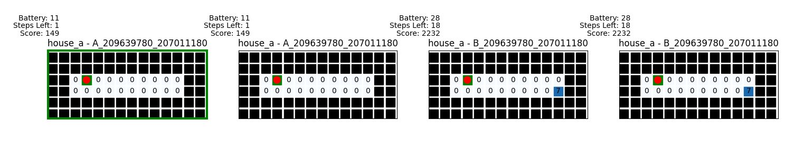

Contributors: Ohad Agadi 209639780, Alexander Beckerman 207011180 

In this assignment, we followed the assignment guidelines and API. We create a MySimulator class to represent the simulator tasked with running the program. We used the future standard library to manage our threads, for counting timeout and retrieving the result. As required, for each house and algorithm we create a house-algorithm combination and call the runSimulation function with a new thread and a maximum of "numThreads" threads, to run the program within the given timeout.

For our first algorithm, we implemented an algorithm that uses DFS to explore and clean the house. The algorithm remembers a DFS state so that it can calcualate the next move between each step function call. The algorithm also uses BFS, to efficiently return to the charging station as well as to return to the last non-explored area of the map to continue the DFS run.

The second algorithm also uses DFS to explore and clean the house and remembers a DFS state. The difference between them is the way they decide on which tile to return to clean after staying in the docking station. This algorithm, instead of going back to the place we stopped, returns to the closest tile which it's surrounding tiles were not cleaned yet.

The relevant output files ACCORDING TO THE ASSIGNMENT REQUIREMENTS will be generated inside the output/ folder, named output_"house file name"_"algo file name".txt . NOTE - The program will also generate additional output files needed for the visualization script, and are not the part of the assignment required output. 

The error files will be generated inside the current directory (build/src/simulator).

HOW TO RUN THE PROGRAM:

The input files will be given to the program as arguments as written in the assignment. To use the shell script to run the program, use 
~~~~~~~~~~~~~
    $ ./scripts/run.sh <-house_path=houses path> <-algo_path=algos path> <num_threads=number of threads>
~~~~~~~~~~~~~
This will build the project and run the main program. If you want to run the program yourself, run the following commands from the exercise directory:
~~~~~~~~~~~~~
$ mkdir build
$ cd build
$ cmake ..
$ make
$ cd src/simulator
$ ./myrobot <-house_path=houses path> <-algo_path=algos path> <summary_only> <num_threads= number of threads>
~~~~~~~~~~~~~
-- BONUS -- 
How our visualization bonus looks like:

